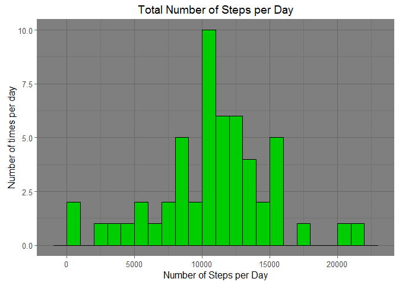
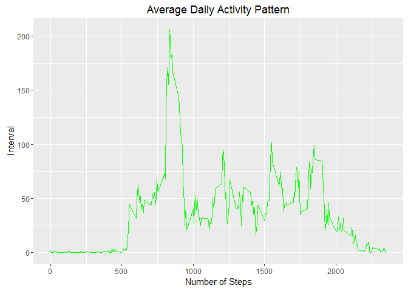
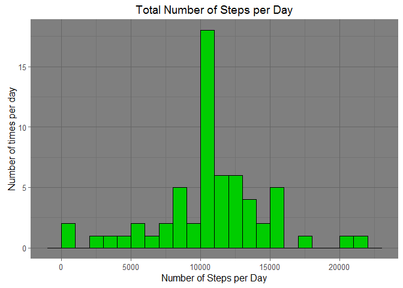
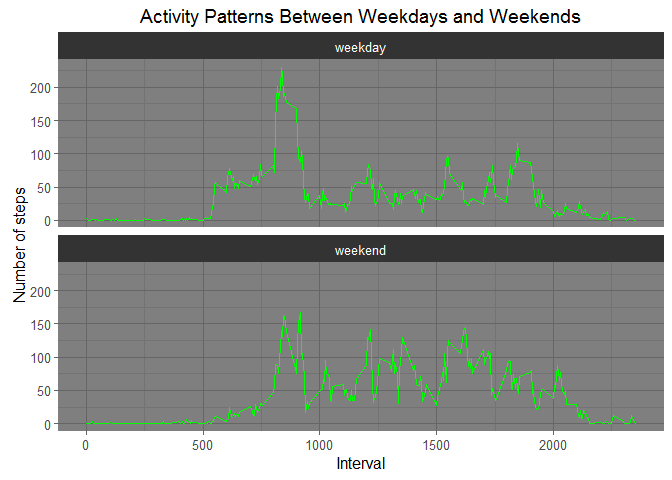

# Reproducible Research: Peer Assessment 1

## Loading and preprocessing the data
First I loaded the data using the `read.csv()` function. Then I parsed out all of the rows 
containing NA values for steps.


```r
library(ggplot2)

mydata <- read.csv("activity.csv", colClasses = c("integer", "Date", "factor"))
mydata <- mydata[complete.cases(mydata),]
```

## What is mean total number of steps taken per day?

First we need to aggreate the data to calculate the total steps per day.


```r
stepsPerDay <- aggregate(steps ~ date, mydata,sum)
```

Now I can create a histogram of the total number of steps taken per day.


```r
qplot(steps,data = stepsPerDay,binwidth =1000) + geom_histogram(binwidth =1000, color = "black",fill=3) + 
theme_dark() + 
ggtitle("Total Number of Steps per Day") +
xlab("Number of Steps per Day") +
ylab("Number of times per day")
```



Next I calculated the ***mean*** and ***median*** of the number of steps taken per day.


```r
stepsMean <- mean(stepsPerDay$steps)
stepsMedian <- median(stepsPerDay$steps)
```

The mean is **10766.19** and median is **10765**.

## What is the average daily activity pattern?

First we need to aggregate the data by the 5-minute intervals and average the number of steps taken.


```r
stepsPerInterval <- aggregate(mydata$steps, list(interval=mydata$interval),mean)
```

Next we need to convert the intervals back to numeric type for ploting


```r
stepsPerInterval$interval <- as.numeric(levels(stepsPerInterval$interval))[stepsPerInterval$interval]
```

We can then plot a time series of the 5-minute interval and average number of steps taken
averaged across all days.


```r
ggplot(stepsPerInterval, aes(x=as.integer(interval),y=x)) + geom_line(color="green") +
xlab("Number of Steps") +
ylab("Interval") +
ggtitle("Average Daily Activity Pattern")
```



Finally we can find the interval that contains the maximum number of steps.

```r
intervalMaxSteps <- stepsPerInterval[which.max(stepsPerInterval$x),]
```

The **835<sup>th</sup>** interval contains the maximum **206** steps.


## Imputing missing values

### 1. Calculate and report the total number of missing values in the dataset (i.e. the total number of rows with NAs)

First I reloaded clean data since I previously removed the NA rows.

```r
mydata <- read.csv("activity.csv", colClasses = c("integer", "Date", "factor"))
```

To find the total number of missing values in the step data, I used the `is.na()` to locate
**NA** entries in the data. Then I used sum to find the total.


```r
na_rows <- which(is.na(mydata$steps))
na_total <- sum(table(na_rows))
```
The total number of missing values is **2304**.

### 2. Devise a strategy for filling in all of the missing values in the dataset. The strategy does not need to be sophisticated. For example, you could use the mean/median for that day, or the mean for that 5-minute interval, etc.

The strategy I used to fill in the missing values, was to replace them with the mean
value of the corresponding interval which we calculated earlier.


```r
fill_missing <- function(data, intervalData){
  na_rows <- which(is.na(data$steps))
  na_with_interval_averages <- merge(intervalData,data[na_rows,], by="interval")
  na_replaced <- na_with_interval_averages[,c(2,4,1)]
  colnames(na_replaced) <- c("steps","date","interval")
  data[na_rows,] <- na_replaced
  data
}
```

### 3. Create a new dataset that is equal to the original dataset but with the missing data filled in.

I then took the replaced data and created a new data set using the function i created.

```r
newdata <- fill_missing(mydata,stepsPerInterval)
```

Just to verify I confirmed that there are no longer any missing values.

```r
sum(is.na(newdata$steps))
```

```
## [1] 0
```

###4. Make a histogram of the total number of steps taken each day and Calculate and report the mean and median total number of steps taken per day. Do these values differ from the estimates from the first part of the assignment? What is the impact of imputing missing data on the estimates of the total daily number of steps?

We can repeat the same process we did for the first histogram with the new data set.

```r
stepsPerDayNew <- aggregate(steps ~ date, newdata,sum)

qplot(steps,data = stepsPerDayNew,binwidth =1000) + 
geom_histogram(binwidth =1000, color = "black",fill=3) + 
theme_dark() + 
ggtitle("Total Number of Steps per Day") +
xlab("Number of Steps per Day") +
ylab("Number of times per day")
```



We can also get the new ***mean*** and ***median*** of the new data set.


```r
stepsMeanNew <- mean(stepsPerDayNew$steps)
stepsMedianNew <- median(stepsPerDayNew$steps)
```

The mean is **10766.19** and median is **10766.19**.

As you can see the median has slightly increased from the original estimate. Also both the
 mean and median are now identical. By filling in the missing data our peak has increased
 but the overall outcome hasn't changed signifigantly to affect our estimates.

## Are there differences in activity patterns between weekdays and weekends?


First I added a weekday column to our new data set using the `weekdays()` function.

```r
newdata$weekday <- as.factor(weekdays(newdata$date))
```


Next, I split the data into 2 subsets of **weekdays** and **weekends**.

```r
weekdays <- subset(newdata, !weekday %in% c("Saturday","Sunday"))
weekends <- subset(newdata, weekday %in% c("Saturday","Sunday"))
```

Next we need to calculate the step averages per interval. I create a function `averageSteps` to remove duplicate code.

```r
averageSteps <- function(data){
  steps <- aggregate(data$steps, list(interval=data$interval),mean)
  steps$interval <- as.numeric(levels(steps$interval))[steps$interval]
  steps
}

weekday_steps <- averageSteps(weekdays)
weekend_steps <- averageSteps(weekends)
```

Now we can aggreate all of the data into a single data frame.


```r
weekend_steps$day <- rep("weekend", nrow(weekend_steps))
weekday_steps$day <- rep("weekday", nrow(weekday_steps))

data_by_day <- rbind(weekend_steps, weekday_steps)
data_by_day$day <- as.factor(data_by_day$day)
```

Finally we can plot the data in two panels to compare the average number of steps taken in each 5-minute interval across weekdays and weekends.


```r
ggplot(data_by_day, aes(x=interval, y=x)) + 
        geom_line(color="green") + 
        facet_wrap(~ day, nrow=2, ncol=1) +
        labs(x="Interval", y="Number of steps") +
        ggtitle("Activity Patterns Between Weekdays and Weekends") +
        theme_dark()
```


